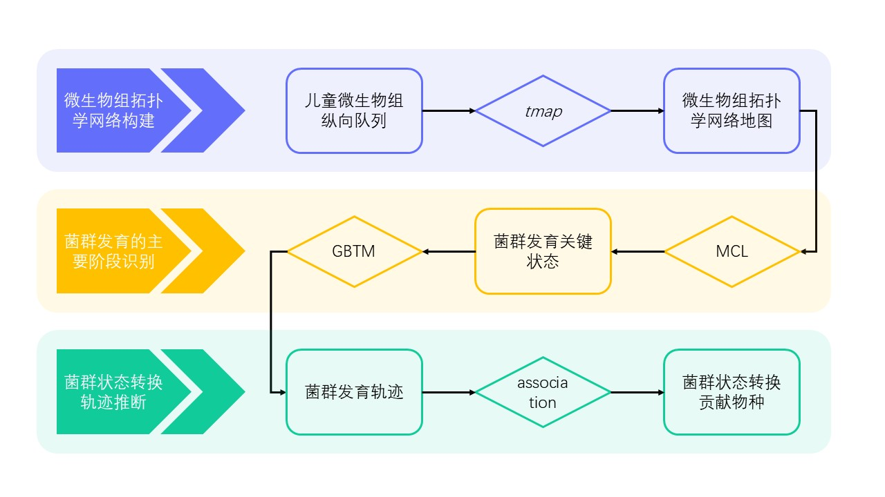

<!-- PROJECT LOGO -->
 
<h3 align="center"><i>tmap</i> trajectory</h3>

  

    A microbiome dynamics analysis based on topological data analysis.
     
     
    <a href="https://github.com/GPZ-Bioinfo/tmap-trajectory/results">Show results</a>
    &middot;
    <a href="https://github.com/GPZ-Bioinfo/tmap-trajectory/issues/new?labels=bug&template=bug-report---.md">Report Bug</a>
    &middot;
    <a href="https://github.com/GPZ-Bioinfo/tmap-trajectory/issues/new?labels=enhancement&template=feature-request---.md">Request Feature</a>
  

## About this project

This project attempts to develop a microbiome analysis method based on topological data analysis techniques, enabling us to analyze, compare, and evaluate trends in microbiota intervention changes. We apply this approach on an early life mcirobiome cohort to 

* characterize the key states of microbiome changes from initial colonization to stablization;
* infer the trajectory of microbiome development;
* identify the key species driving the microbiome changes along the trajectory.

We generate a _tmap_ network to serve as the skeleton of the microbiome data, then cluster the microbiome network with Markov cluster algorithm (MCL), and utilize the trajectory with Group-base trajectory modelling (GBTM).

## Contents

* `data/`: Input and output files for analyzing the early life microbiome development.

* `results/`: Figures and interpretation resulted from the analysis of early life microbiome development.

* `scripts/`: Scripts for MCL clustering and DMM benchmark.

## Roadmap

We finished the first two steps, and the rest would come in near future.

[ ] trajectory inference (GBTM)

[ ] species contribution along the trajectory of microbiome development

## References

* Olm, Matthew R., et al. "Robust variation in infant gut microbiome assembly across a spectrum of lifestyles." Science 376.6598 (2022): 1220-1223. https://doi.org/10.1126/science.abj2972
