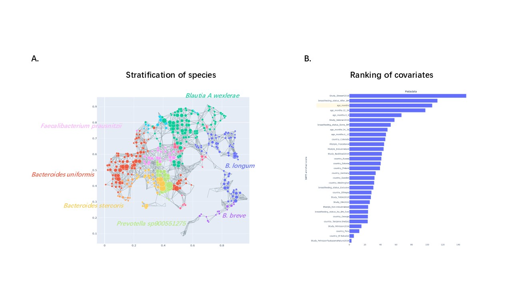
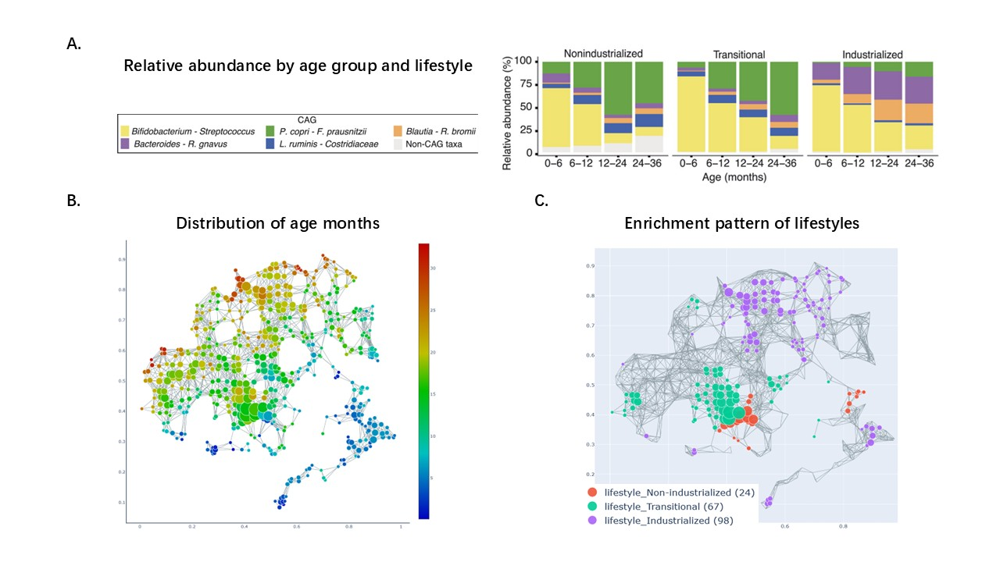
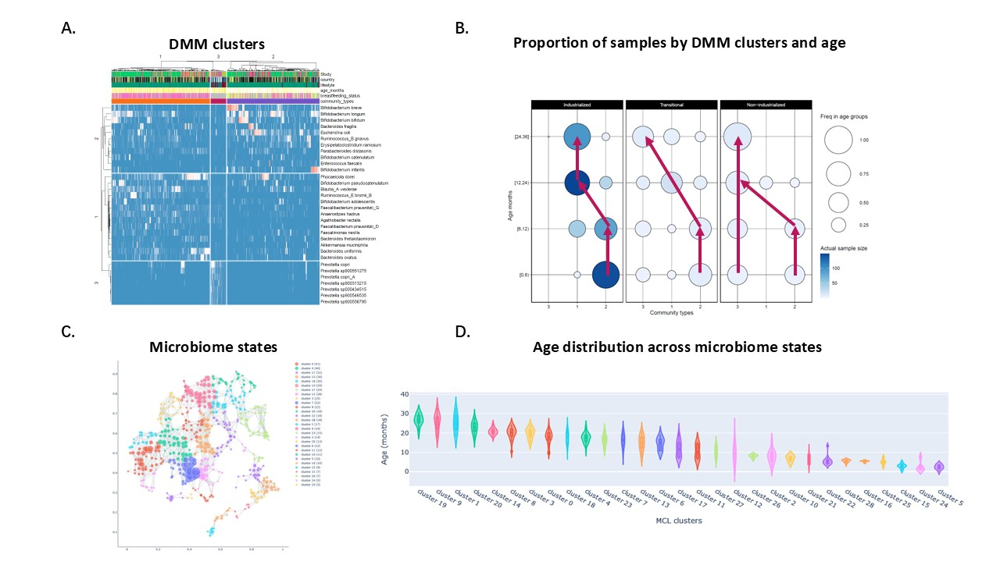

## Early life microbiome development

Microbiome dynamics analysis is a crucial technology for decoding the mechanisms of host-microbiota interaction, particularly indispensable in microbiome clinical intervention cohort studies. Traditional analysis of microbiome time-series data relies on simplified species co-variation ecological models, which cannot effectively integrate complex microbiome and host phenotype data, making it difficult to uncover the inherent patterns of microbiota dynamic changes and their associations with host phenotypes. Previous research has shown that human gut microbiota exists in various complex structural states, with microbial perturbations accompanied by transitions between these states and changes in key driving species. In this project, we apply our microbiome dynamics analysis method based on topological data analysis techniques on the early life microbiome cohort, enabling the identification of microbiota states, construction of state transition trajectories, and analysis of interaction patterns between key species.

#### Data

We took avantage of the datasets curated by by Olm et al., which sequencing healthy infants aged 0-36 months from Hadza hunter-gatherer society in Tanzania, and conducting a global meta-analysis incorporating infant microbiome data from prior studies across various lifestyles.

#### Stratification of infant microbiome

We applied _tmap_ on this dataset, which consists of 682 samples from 12 countries, and 2262 MAGs. It showed a distinct pattern of stratifications of microbiome landscape (Fig 1A). Based on the similarity of microbial composition, samples were divided into 12 clusters on the map. Notably, _Bifidobacterium_, _Blautia wexlerae_, _Faecalibacterium prausnitzii_, _Bacteroides_, and _Prevotella_ were the key species driving the stratification. To explore the host phenotypes associated with the stratification, we performed the spatial analysis of functional enrichment (SAFE) analysis. The results indicated a strong correlation with host age as well as lifestyle (Fig 1B), which was supported by the referenced article.

Fig 1. Infant microbiome assembly and covariates. A) Stratification and driving species. B) Covariates associated with microbiome

#### Age and lifestyle are associated with infant microbiome assembly

Olm et al. demonstrate that the _Bifidobacterium-Streptococcus_ CAG dominates infants from all lifestyles in early life (0 to 6 months), and over time this CAG yields to the _Bacteroides-Ruminocccocus_ gnavus CAG in industrialized infants and the _Prevotella-Faecalibacterium_ CAG in infants living transitional or nonindustrialized lifestyles (Fig 2A). Lifestyle-related differences in dominant CAGs become more pronounced over time and mirror taxonomic trade-offs observed in late infancy and adulthood.

Our work provided a more dynamic and intuitive visualization of the effects of age and lifestyle on early microbiota assembly and their interactions. Younger infants exhibited highly similar microbiota compositions, clustering in the lower-right corner of the network map (blue region). In contrast, older children displayed more dispersed microbiota compositions, distributed across distinct regions (red regions in the upper-left and lower-left corners), indicating diverse microbiota maturation process (Fig 2B). The trajectories of microbial development differ from lifestyle contexts (Figure 2C). According to stratification pattern, we found that _Bifidobacterium_ was a dominant driver in early microbiota assembly, leading to clustering of infant microbiota regardless of lifestyle. However, with increasing age, industrialized children’s microbiota tended to develop along a trajectory enriched with _Blautia_, while non-industrialized children’s microbiota followed a path enriched with _Prevotella_.

These findings align closely with those of the original study. Furthermore, by analyzing the co-enrichment patterns of age and lifestyle on the microbial map, we captured a more nuanced depiction of how their interplay shapes microbiota development, ultimately leading to distinct maturation outcomes.

Fig 2. Age and lifestyle are associated with infant microbiome assembly. A) Relative abundance of CAGs by age group and lifestyle resulted from reference article. B) Age distribution on microbiome network. C) Enrichment pattern of lifestyle on microbiome network.

#### Characterization of infant microbiome development

To further explore how early gut microbiota transition from similar initial states to diverse mature configurations, we employed the Dirichlet Multinomial Mixture Model (DMM) for clustering analysis of microbial communities. The analysis identified three distinct community types (Figure 3A):

* Type C2: Dominated by Bifidobacterium, predominantly observed in infants aged 0–6 months.

* Type C1: Characterized by Bacteroides as the major taxa, frequently seen in samples from children 12 months or older.

* Type C3: Defined by Prevotella dominance, particularly prevalent in populations living in non-industrialized environments.

We inferred potential developmental trajectories of the gut microbiota based on the distribution of these microbiota types across age groups (Figure 3B). Industrialized lifestyle (Figure 3B, left panel): The early gut microbiota, predominantly Bifidobacterium-dominated C2, gradually transitions into the Bacteroides-dominated C1 type as infants grow older. Transitional lifestyle (Figure 3B, middle panel): This trajectory shows a progressive shift from the Bifidobacterium-dominated C2 type toward the Bacteroides-dominated C1 type, with further development into the Prevotella-dominated C3 type after 24 months of age. Non-industrialized lifestyle (Figure 3B, right panel): Regardless of the initial microbiota type (C2 or C3), the microbiota consistently transitions to a stable C3 state dominated by Prevotella after 12 months of age.

These findings highlight the diversity in microbiota developmental trajectories and underscore the decisive influence of lifestyle on the maturation pathways of the gut microbiome. Specifically, industrialized lifestyles tend to drive microbiota maturation toward a Bacteroides-dominated state, while non-industrialized settings favor the evolution of a Prevotella-dominant community.

This analysis provides critical insights into the dynamic processes underlying early gut microbiota development and sheds light on the long-term health implications of lifestyle-driven differences in microbiota maturation.

Fig 3. Characterization of infant microbiome development. A) Heatmap of DMM clusters. B) Proportion of samples by DMM clusters and age.
